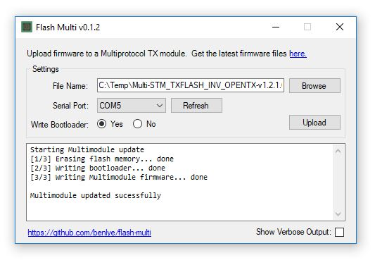

# Flash Multi
 <a href="https://scan.coverity.com/projects/benlye-flash-multi"></a>

# About Flash Multi
Flash Multi is an application for managing the firmware on a Jumper, iRangeX, Vantac, 'Banggood', or DIY MULTI-Module.  A GUI application is available for Windows and a shell script for Linux and macOS.

Flash Multi can read the existing firmware, save a backup, and write new firmware.

For STM32 modules, firmware read/write operations can be performed using the built-in USB connection or via an external USB-to-serial adapter.  For ATmega328p modules a USBasp programmer is required.

Just three steps are required to update your Jumper, iRangeX, or DIY MULTI-Module (full instructions are below):
1. [Download and install](#installing-flash-multi) Flash Multi and any required [device drivers](#additional-drivers)
1. Download the appropriate [MULTI-Module firmware file](https://downloads.multi-module.org/)
1. [Write](#using-flash-multi) the new firmware to your module

<p align="center">
  
</p>

# Documentation Index
1. [Supported Modules](#supported-multi-modules)
1. [Flash Multi Requirements](#flash-multi-requirements)
1. [Installing Flash Multi](#installing-flash-multi)
   1. [Windows](#windows)
      1. [Additional Drivers](#additional-drivers)
   1. [Linux and Mac](#linux-and-mac)
1. [Using Flash Multi](#using-flash-multi)
   1. [Writing (Updating) Firmware](#writing-updating-firmware)
      1. [Writing the Bootloader](#writing-the-bootloader)
      1. [Upload Output](#upload-output)
   1. [Reading the Module](#writing-updating-firmware)
      1. [Read Output](#read-output)
   1. [Saving Backups](#saving-backups)
   1. [Erasing the Module](#erasing-the-module)
   1. [Advanced](#advanced)
      1. [Actions](#actions)
         1. [Install USB Drivers](#install-usb-drivers)
         1. [Reset Module to DFU Mode](#reset-module-to-dfu-mode)
         1. [Upgrade Module Bootloader](#upgrade-module-bootloader)
      1. [Settings](#settings)
         1. [Serial Baud Rate](#serial-baud-rate)
         1. [Run Fimrware After Write](#run-firmware-after-write)
1. [Cloning a MULTI-Module](#cloning-a-multi-module)
   1. [How to Clone a Module](#how-to-clone-a-module)
      1. [EEPROM Backup and Restore](#eeprom-backup-and-restore)
      1. [Compile Firmware with a Fixed Global ID](#compile-firmware-with-a-fixed-global-id)
1. [MULTI-Module Firmware](#multi-module-firmware)
1. [Troubleshooting](#troubleshooting)
1. [More Information](#more-information)
1. [Warranty](#warranty)

# Supported MULTI-Modules
All MULTI-Module based on the STM32 or ATmega328p microcontrollers are supported.  OrangeRX modules are _not_ supported (yet).

Supported modules include:
* Jumper JP4IN1 and JP4IN1-SE
* Jumper T16 Pro internal modules - **only with a USB-to-serial adapter**
* iRangeX IRX4, IRX4 Plus, and IRX4 Lite
* Vantac MPM Lite
* 'Banggood' STM32 and ATmega328p MULTI-Modules
* DIY STM32 and ATmega328p MULTI-Modules

## Note for Jumper T16 Pro Owners
**Flash Multi cannot be used to update the internal module in a Jumper T16 by connecting to the radio's USB port.**

If your internal module has MULTI-Module firmware v1.2.1.85 or newer, and the radio is running OpenTX v2.3.2 or newer, you can update the internal module from the radio using [this process](https://www.multi-module.org/using-the-module/firmware-updates/update-methods#opentx).

If your MULTI-Module has MULTI-Module firmware v1.2.1.51 you must use Flash Multi and a USB-to-serial adapter to update it one time, as explained [here](https://www.rcgroups.com/forums/showthread.php?3428887-Jumper-T16-Internal-Multiprotocol-Module-Firmware-Update).  Subsequent updates can then be installed from the radio.

# Flash Multi Requirements
Flash Multi requires .Net Framework 4.5 or newer.  You probably already have a compatible version installed, but if not, the latest version can be downloaded from [Microsoft](https://dotnet.microsoft.com/download/dotnet-framework).
> _Tip: When you launch Flash Multi it will tell you if you need to install or upgrade your .Net Framework._

# Installing Flash Multi
## Windows

1. Download `flash-multi-[version].zip` from the [latest release](https://github.com/benlye/flash-multi/releases/latest)
1. Unzip the zip file to a convenient location
1. Launch the application by running `flash-multi.exe`

### Additional Drivers
**Depending on your MULTI-Module and version of Windows you may need to install additional drivers manually.**

#### Maple USB
The Maple USB driver, which is used by many MULTI-Modules, including original Jumper JP4IN1 modules, iRangeX IRX4 and IRX4+ modules, and all Banggood STM32 modules, can be installed using the driver installer which is included with Flash Multi.

**Note:** Make sure your MULTI-Module is not plugged in when you run the Maple USB driver installer.  This is to avoid potential problems with the driver installation.

1. Locate the folder where you unzipped Flash Multi
1. Run `\drivers\install_drivers.bat` to install the Maple USB device drivers

#### Jumper JP4IN1-SE
The driver for the Jumper JP4IN1 module, the Silicon Labs CP210x driver, is **not** included with Flash Multi and can be downloaded from here:
https://www.silabs.com/products/development-tools/software/usb-to-uart-bridge-vcp-drivers

Other drivers may be needed if you are using an external USB-to-serial adapter. Consult the documentation for your adapter.

*Windows 10 includes drivers for many common serial devices, including many USB-to-serial adapters, so check Device Manager to see if your device is recognised.*

## Linux and Mac
Please refer to the [Linux and macOS instructions](doc/Linux.md).

# Using Flash Multi
**Note:** The first time you flash your module you may need to connect it with an external USB-to-serial adapter in order to flash the bootloader. The bootloader is required in order for the native USB port work, and it can only be written with a USB-to-serial adapter.  This does not apply to newer Jumper 4IN1 modules, which have an _internal_ USB-to-serial adapter.

**Note for external USB-to-serial connections:** When using an external USB-to-serial adapter, the `BOOT0` pin on the board must be connected to 3.3V, usually by installing a jumper on the `BOOT0` header pins.

## Writing (Updating) Firmware

1. If the module is installed in the radio and you are connecting to the module's USB port, ensure the radio is powered **off**
1. Launch **Flash Multi**
1. Connect your module to the computer using the module's USB port, an external USB-to-serial adapter, or a USBasp device (ATmega328p modules only), as appropriate
   > _Tip: Flash Multi will automatically select the new COM port / device, if it's running when the module is plugged in._
1. Click the **Browse** button and select a compiled firmware file
   1. Details of the selected firmware file will be shown.  Carefully check that the file matches your requirements.
1. If it wasn't automatically selected, select the appropriate COM port or device
1. Click the **Write Module** button
   1. If the selected file was a backup made with EEPROM data, you will be asked to confirm that you want to write it

### Writing the Bootloader
The bootloader enables flashing the MULTI-Module firmware from a radio which supports this (see [here](https://github.com/pascallanger/DIY-Multiprotocol-TX-Module/blob/master/docs/Flash_from_Tx.md)).  It also enables the native USB port on MULTI-Modules which have one, facilitating firmware updates via native USB rather than an external USB-to-serial adapter.

When flashing with a USB-to-serial adapter the bootloader will be written automatically if the selected firmware file was compiled with support for it.

When flashing via the native USB port the firmware being flashed _must be compiled with support for the bootloader_ otherwise, to avoid rendering the module inoperable, Flash Multi will display an error and stop the flash attempt.

### Upload Output
The output will vary depending on the type of module being flashed.

Modules connected via an external USB-to-serial adapter, and the Jumper JP4IN1 module (which has an *internal* USB-to-serial adapter behind the USB port) will see output like this:
```
Starting MULTI-Module update
[1/3] Erasing flash memory... done
[2/3] Writing bootloader... done
[3/3] Writing MULTI-Module firmware... done

MULTI-Module updated sucessfully
```

> _Note: Step 2, writing the bootloader, is not performed when writing firmware which was not compiled with support for the native USB / Flash from TX bootloader._

Modules connected via USB (except the Jumper JP4IN1) will see output like this:
```
Maple device found in USB mode
Starting MULTI-Module update
Switching MULTI-Module into DFU mode ... done
Waiting for DFU device ... got it
Writing firmware to MULTI-Module ... done

MULTI-Module updated sucessfully
```

For both methods, if the 'Show Verbose Output' box is checked the actual output from each of the flash proceses will be shown. If the flash fails for any reason the verbose messages are a good place to look for more details.

## Reading the Module
Flash Multi can read the existing firmware from the module and, if it is recent (newer than v1.2.1.79), display information about it, as well as the EEPROM Global ID of the module.

1. If the module is installed in the radio and you are connecting to the module's USB port, ensure the radio is powered **off**
1. Launch **Flash Multi**
1. Connect your module to the computer using the module's USB port, an external USB-to-serial adapter, or a USBasp device (ATmega328p modules only), as appropriate
   > _Tip: Flash Multi will automatically select the new COM port / device, if it's running when the module is plugged in._
1. If it wasn't automatically selected, select the appropriate COM port or device
1. Click the **Read Module** button

### Read Output
For a recent firmware version, the output will look similar to this:
```
Reading from MULTI-Module via native USB
Switching MULTI-Module into DFU mode ... done
Reading flash memory ... done

Multi Firmware Version:   1.3.1.9 (STM32)
Expected Channel Order:   AETR
Multi Telemetry Type:     OpenTX
Invert Telemetry Enabled: True
Flash from Radio Enabled: True
Bootloader Enabled:       True
Serial Debug Enabled:     False

EEPROM Global ID:         0x665DEF2A

MULTI-Module read successfully
```

## Saving Backups
Once the module has been read, the existing firmware can be saved.  The backup can optionally include the EEPROM data.  Saving the EEPROM data allows a module to be cloned.

1. Read the Module
1. Click the **Save Backup** button
1. Select whether or not to include the EEPROM data (default is no)
1. Specify a location for the backup file and click **Save**

**NOTE:** When saving a backup from an Atmega328p module, two files will be created - one containing the firmware and a second containing the EEPROM.  For an STM32 module the firmware and EEPROM data are in the same file.

## Erasing the Module
Erasing the module will remove the firmware, and optionally erase the EEPROM data.  Once erased, new firmware will need to be written to the module.

**THIS OPERATION CANNOT BE UNDONE**

Erasing the EEPROM data is necessary to restore a module which has had a backup which included EEPROM data retored to it (making it a clone) back to having its own unique ID.

1. If the module is installed in the radio and you are connecting to the module's USB port, ensure the radio is powered **off**
1. Launch **Flash Multi**
1. Connect your module to the computer using the module's USB port, an external USB-to-serial adapter, or a USBasp device (ATmega328p modules only), as appropriate
   > _Tip: Flash Multi will automatically select the new COM port / device, if it's running when the module is plugged in._
1. If it wasn't automatically selected, select the appropriate COM port or device
1. Click the **Erase Module** button
   1. Confirm that you want to erase the module
   1. Tell Flash Multi if you also want to erase the EEPROM data
   1. Confirm that you really want to erase the module

Once again, **THIS OPERATION CANNOT BE UNDONE**.

## Advanced
The **Advanced** menu contains extra features and settings.

### Advanced Actions
The **Advanced -> Actions** menu can be used to access several extra actions.

#### Install USB Drivers
Clicking **Advanced -> Actions -> Install USB Drivers** will install or upgrade the MULTI-Module USB drivers.

Drivers can be installed with or without a MULTI-Module plugged into the computer.

**Note:** For best results, do the driver installation with the MULTI-Module plugged in.  If the module is plugged in, it will be reset to DFU mode during the driver installation.  This is to ensure that the DFU-mode drivers are installed or upgraded properly - if an older driver is present it cannot be updated if the module is not connected.  Once the driver installation is complete, you can unplug the module and plug it back in to reset it, but this is not necessary.

#### Reset Module to DFU Mode
Clicking **Advanced -> Actions -> Reset Module to DFU Mode** will reset the attached MULTI-Module into DFU mode.

This is not normally necessary to do manually, but it may be needed for troubleshooting driver problems.  This menu item is only enabled when a MULTI-Module in USB Serial mode is attached, and the COM port corresponding to the module is selected.

#### Upgrade Module Bootloader
Clicking **Advanced -> Actions -> Upgrade Module Bootloader** will update the MULTI-Module's bootloader.

Updating the bootloader is necessary for some MULTI-Modules which are known to ship with broken or out-of-date bootloaders installed.  Clicking **Upgrade Module Bootloader** will replace the MULTI firmware with an application which will update the bootloader.  Once the process completes the module must be unplugged, plugged back in, and new firmware written to it.

**Important:** Read the on-screen instructions and pay attention to the module's red LED during the bootloader upgrade process.  It is important not to unplug the module until the red LED has been off for more than 5 seconds.

This menu item is only enabled when a MULTI-Module in USB Serial mode or DFU Bootloader mode is attached, and the COM port (or DFU Device) corresponding to the module is selected.

### Advanced Settings
#### Serial Baud Rate
Sets the baud rate which is used to read and write MULTI-Modules using an internal or external USB-to-Serial adapter.  Value can be 57,600 or 115,200 (default).  

Try the lower rate if you have problems reading or writing a device.

#### Run Firmware After Write
Enable or disable running the MULTI firmware after it has been written to the module.  Default is enabled (run the firmware after write).

# Cloning a MULTI-Module
Cloning a MULTI-Module means using the Global ID of one module on another.  This may be useful if you have multiple radios or multiple MULTI-Modules and you want all your modules to control all your models without re-binding them.

**NOTE:** The EEPROM Global ID is not used by protocols which use the CYRF6936 RF component.  You must compile your own firmware with a fixed CYRF ID to acheive the same result for those protocols (Devo, DSM, J6Pro, Traxxas, WFly, WK2x01).

## How to Clone a Module
There are two ways to clone a module:

### EEPROM Backup and Restore
EEPROM backup and restore can only be performed with modules with the same MCU - e.g. you cannot backup and Atmega328p module and restore it to an STM32 module.

1. Make a backup of the module to be cloned, making sure you include EEPROM data
1. Restore the backup to the target module

After restoring the EEPROM you can treat the clone target module like any other - firmware can be read, written, updated etc.  The EEPROM data will not be changed.

**Note:**

### Compile Firmware with a Fixed Global ID
Global IDs can be copied between modules of any type.

1. Use Flash Multi to read the module to be cloned, make a note of the EEPROM Global ID
1. Use the Arduino IDE to compile your own firmware from source, defining the ID from step one in the `FORCE_GLOBAL_ID` section

**Note:** If you use Flash Multi to read a module which is running firmware which was compiled with a fixed Global ID, the EEPROM Global ID which is read **will not be the ID the module is actually using**.

# MULTI-Module Firmware
Pre-compiled MULTI-Module firmware can be downloaded from [https://downloads.multi-module.org/](https://downloads.multi-module.org/).

The MULTI-Module firmware can also be [compiled from source](https://github.com/pascallanger/DIY-Multiprotocol-TX-Module/blob/master/docs/Compiling_STM32.md) relatively easily.

# Troubleshooting
See the dedicated [Troubleshooting page](doc/Troubleshooting.md).

# More Information
Much more information about flashing a MULTI-Module, including how to connect a USB-to-serial adapter and connect the `BOOT0` pin, can be found in the documentation for the MULTI-Module at https://github.com/pascallanger/DIY-Multiprotocol-TX-Module/blob/master/README.md.

# Warranty
Flash Multi is free software and comes with ABSOLUTELY NO WARRANTY.
