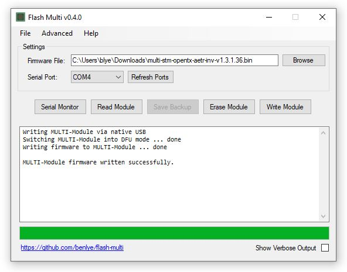

# Flash-Multi
Tool for flashing pre-compiled firmware to an STM32-based Multiprotocol TX module via an FTDI adapter or the built-in USB connection. 

  

# Supported Modules
* Jumper JP4IN1
* iRangeX IRX4, IRX4 Plus, and IRX4 Lite
* Vantac MPM Lite
* 'Banggood' STM32 Multiprotocol TX Modules
* DIY STM32 Multiprotocol TX Modules

# Installation
## Using the Installer
1. Download the latest installer (`flash-multi-[version].exe`) from the [Releases](https://github.com/benlye/flash-multi/releases) page
1. Run the installer to install the application and required drivers
1. Launch the 'Flash Multi' from the Start menu

## Manual Installation
1. Download the latest .zip archive (`flash-multi-[version].zip`) from the [Releases](https://github.com/benlye/flash-multi/releases) page
1. Unzip the archive to a convenient location
1. Run `\drivers\install_drivers.bat` to manually install the required drivers
1. Launch the application by running `flash-multi.exe`

# Use
**Note for IRX4, Banggood, and DIY modules:** The first time you flash your module you will need to connect it with an FTDI adapter in order to flash the bootloader. The bootloader is required in order for the USB port to work and it can only be written with an FTDI adapter.

**Note for FTDI connections:** When using an FTDI adapter the `BOOT0` pin on the board must be connected to 5V, usually by installing a jumper on the `BOOT0` header pins.

1. If the module is installed in the radio, ensure the radio is powered **off**
1. Connect your module to the computer using the USB port or via an FTDI adapter, as appropriate.  Note the COM port which appears when the device is connected.
1. Launch Flash Multi
1. Click the **Browse** button and locate a compiled firmware file
1. Select the appropriate COM port
1. Click the **Go** button

# Multiprotocol Firmware
Pre-compiled Multiprotocol firmware can be downloaded from the Multiprotocol TX Module [Releases](https://github.com/pascallanger/DIY-Multiprotocol-TX-Module/releases).

The Multiprotocol firmware can also be [compiled from source](https://github.com/pascallanger/DIY-Multiprotocol-TX-Module/blob/master/docs/Compiling_STM32.md) relatively easily.

# More Information
Much more information about flashing a Multiprotocol module, including how to connect an FTDI adapter and connect the `BOOT0` pin, can be found in the documentation for the DIY Multiprotocol Module at https://github.com/pascallanger/DIY-Multiprotocol-TX-Module/blob/master/README.md.
