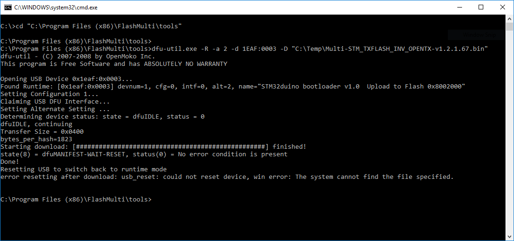

# Troubleshooting
Fortunately it is nearly impossible to 'brick' an STM32, so whatever state your Multiprotocol module is in, it should be possible to recover it.

## Module stuck in DFU mode after flashing and cannot be re-flashed
If your module isn't working, it shows up in Device Manager as **Maple DFU**, and attempting to re-flash it via the native USB port fails with verbose output like this:
```
.\tools\dfu-util.exe -R -a 2 -d 1EAF:0003 -D "C:\Temp\Multi-STM_FTDI_INV_OPENTX-v1.2.1.67.bin"

Lost Device after reset, assuming prod_id was incremented by oneNo DFU capable USB device found
dfu-util - (C) 2007-2008 by OpenMoko Inc.

This program is Free Software and has ABSOLUTELY NO WARRANTY
```

Most likely you have flashed a non-USB enabled firmware over the USB port, making the USB port (and the module) inoperable.

Luckily, the USB bootloader always starts the module up briefly in DFU mode, and we can take advantage of that to re-flash it.

### Recovery
1. Download or compile the correct, **USB-enabled**, firmware
1. Open a **Command Prompt** and change to the 'tools' sub-folder in the Flash Multi folder
   
   E.g.:
   `cd "C:\Program Files (x86)\FlashMulti\tools"`

1. Prepare the `dfu-util.exe` flash command, but don't run it yet:

   `dfu-util.exe -R -a 2 -d 1EAF:0003 -D "[firmware_file]"`
   
   E.g.: `dfu-util.exe -R -a 2 -d 1EAF:0003 -D "C:\Temp\Multi-STM_TXFLASH_INV_OPENTX-v1.2.1.67.bin"`

1. Unplug the module
1. Plug the module in and watch the green LED - it blinks very rapidly, then blinks slightly slower, then goes out
1. Unplug the module again
1. Plug the module in and as soon as the green LED is in the second phase, hit **[Enter]** in the Command Prompt to run the flash command

You have about 0.5s to run the `dfu-util.exe` flash command while the green LED is in the second phase.

You may need to try it a few times, but if you can hit enter in the command prompt as soon as the green LED changes to the second phase you will be able to re-flash the module and it will be back to normal.  Once you've got the hang of the timing you'll be able to do it easily.

<p align=center></p>

**Note:** `dfu-util.exe` always gives this error at the end:

`error resetting after download: usb_reset: could not reset device, win error: The system cannot find the file specified.`

You can ignore it.
